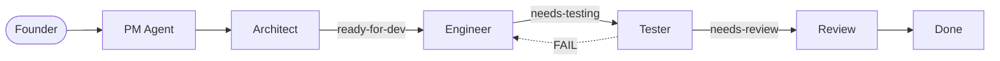

# Operum

> *"Labor omnia vincit"* — Work conquers all

**The complete multi-agent AI development team** — orchestrate 6 specialized Claude agents from a single desktop app.

Operum (Latin: *of works*, from *opus*) automates your development, marketing, and community workflows with a team of AI agents that coordinate through a label-driven pipeline.

## Download

Get the latest Operum desktop app:

| Platform | Download |
|----------|----------|
| Linux | [.deb](https://github.com/alprimak/operum-feedback/releases/latest) · [AppImage](https://github.com/alprimak/operum-feedback/releases/latest) |
| Windows | [.exe installer](https://github.com/alprimak/operum-feedback/releases/latest) |
| macOS | [.dmg](https://github.com/alprimak/operum-feedback/releases/latest) |

[View all releases &rarr;](https://github.com/alprimak/operum-feedback/releases)

## How It Works

Issues flow through the team automatically. Each agent owns specific pipeline stages, updates GitHub labels when done, and hands off to the next agent.

| Agent | Role | What It Does |
|-------|------|-------------|
| **PM** | Orchestrator | Manages pipeline, delegates tasks, reports to founder |
| **Architect** | Technical Design | Reviews issues, provides implementation guidance |
| **Engineer** | Implementation | Writes code, creates PRs, runs tests |
| **Tester** | Quality Assurance | Tests PRs, approves or sends back for fixes |
| **Marketing** | Growth | SEO, content strategy, discoverability |
| **Community** | Support | Monitors channels, responds to users |

## Templates

**The only public repo with production-tested 6-agent Claude Code orchestration.** Use these templates to build your own multi-agent AI system.

### Agent Templates

Define each agent's role, responsibilities, and step-by-step workflow.

| Agent | Role | Template |
|-------|------|----------|
| PM | Orchestrates the team, manages pipeline | [`pm.md`](templates/agents/pm.md) |
| Architect | Reviews tasks, provides architectural guidance | [`architect.md`](templates/agents/architect.md) |
| Engineer | Implements features, writes code, creates PRs | [`engineer.md`](templates/agents/engineer.md) |
| Tester | Tests PRs, reports results, approves for review | [`tester.md`](templates/agents/tester.md) |
| Marketing | SEO, content strategy, growth initiatives | [`marketing.md`](templates/agents/marketing.md) |
| Community | Discord/Twitter monitoring, user support | [`community.md`](templates/agents/community.md) |

### Workflow Templates

The coordination protocols that make multi-agent systems actually work.

| Template | Description |
|----------|-------------|
| [Pipeline](templates/workflows/pipeline.md) | Label-driven issue flow: `backlog → needs-architecture → ready-for-dev → in-progress → needs-testing → needs-review → done` |
| [IPC Protocol](templates/workflows/ipc.md) | File-based inter-agent communication with typed prefixes (`DONE:` / `REQUEST:` / `ERROR:`) |
| [Branching](templates/workflows/branching.md) | Git workflow with agent home branches (`agent/{name}`) and feature branch conventions |
| [Release](templates/workflows/release.md) | Semantic versioning and CI-driven release management |

### Starter Kit

Bootstrap a new multi-agent project in minutes.

| File | Purpose |
|------|---------|
| [`CLAUDE.md.example`](templates/starter/CLAUDE.md.example) | Complete CLAUDE.md composing all templates |
| [`project.toml`](templates/starter/project.toml) | Project metadata template |
| [`goals.toml`](templates/starter/goals.toml) | Goals tracking template |

[View all templates and quick start guide &rarr;](templates/README.md)

## What Makes This Unique

No other public repository provides these patterns:

1. **Label-driven pipeline** — Issues flow through defined stages with clear agent ownership
2. **File-based IPC** — Agents coordinate via trigger/response files with typed prefixes
3. **Agent home branches** — Each agent gets a persistent `agent/{name}` branch for concurrent worktrees
4. **Complete 6-role team** — PM, Architect, Engineer, Tester, Marketing, Community with handoff protocols
5. **Event-driven coordination** — Agents respond to events, with self-assessment as backup

## Submit Feedback

### Bug Reports

Found an issue? [Create a bug report](https://github.com/alprimak/operum-feedback/issues/new?template=bug_report.md&labels=bug)

Please include:
- Operum version (shown in bottom-left of the app)
- Operating system
- Steps to reproduce
- Expected vs actual behavior

### Feature Requests

Have an idea? [Request a feature](https://github.com/alprimak/operum-feedback/issues/new?template=feature_request.md&labels=enhancement)

### General Discussion

Questions or suggestions? [Start a discussion](https://github.com/alprimak/operum-feedback/discussions)

## Community

- **Website**: [operum.ai](https://operum.ai)
- **Discord**: [Join our community](https://discord.gg/operum) *(coming soon)*
- **Documentation**: [operum.ai/docs](https://operum.ai/docs)

## Latin Glossary

| Term | Meaning | Context |
|------|---------|---------|
| *Operum* | Of works | Our name, from *opus* (work) |
| *Opus magnum* | Great work | What you'll build with Operum |
| *Ex nihilo* | From nothing | Start projects from scratch |
| *Carpe diem* | Seize the day | Ship faster with AI agents |
| *Per aspera ad astra* | Through hardships to the stars | The founder's journey |

---

*Made with dedication by solo creators, for solo creators.*
