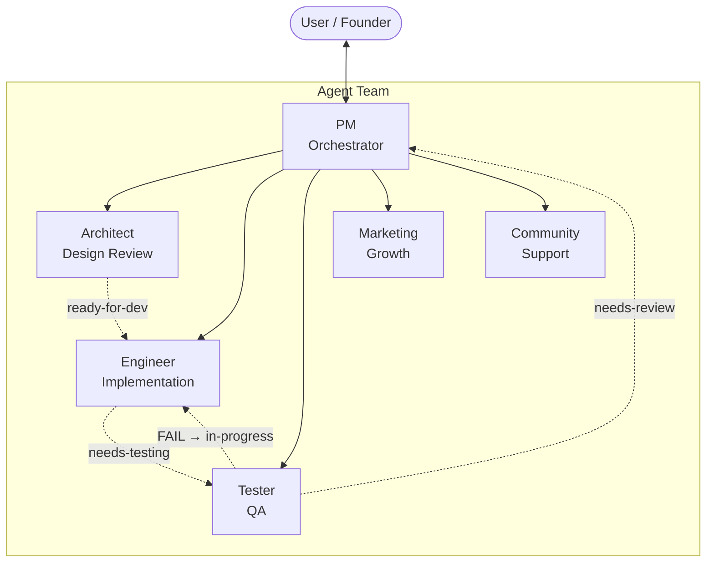
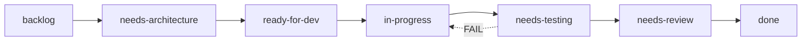

# Operum Agent Templates

[](../LICENSE)
[](https://claude.ai/code)

> Production-tested templates for orchestrating 6 AI agents with Claude Code. The only public repo with a complete label-driven pipeline, file-based IPC, and agent coordination protocols.

## Architecture



## Pipeline

Issues flow through the team via GitHub labels:



Each label has a clear owner. Agents update labels when they complete their stage, triggering the next agent in the pipeline.

## Quick Start

**1. Copy the templates you need:**

```bash
# Clone this repo
git clone https://github.com/alprimak/operum-feedback.git
cd operum-feedback/templates

# Copy agent and workflow templates to your project
cp -r agents/ workflows/ starter/ /path/to/your/project/.operum/templates/
```

**2. Configure your CLAUDE.md:**

Start with [`starter/CLAUDE.md.example`](starter/CLAUDE.md.example) and replace the `{{PLACEHOLDER}}` variables with your project's values. Paste the relevant agent template for each agent's CLAUDE.md.

**3. Set up the IPC directory:**

```bash
mkdir -p shared/triggers shared/responses shared/context
touch shared/context/team-log.md
```

That's it. Your agents can now coordinate through the pipeline.

## Templates

### Agent Templates

Define each agent's role, responsibilities, and workflow.

| Template | Role | Key Capability |
|----------|------|----------------|
| [`agents/pm.md`](agents/pm.md) | Project Manager | Pipeline orchestration, task delegation |
| [`agents/architect.md`](agents/architect.md) | Software Architect | Design review, technical guidance |
| [`agents/engineer.md`](agents/engineer.md) | Software Engineer | Implementation, PRs, testing |
| [`agents/tester.md`](agents/tester.md) | QA Engineer | PR testing, quality gate |
| [`agents/marketing.md`](agents/marketing.md) | Growth Lead | SEO, content, discoverability |
| [`agents/community.md`](agents/community.md) | Community Manager | Support, user engagement |

### Workflow Templates

Define how agents coordinate and move work through the pipeline.

| Template | Purpose |
|----------|---------|
| [`workflows/pipeline.md`](workflows/pipeline.md) | Label-driven issue pipeline (backlog → done) |
| [`workflows/ipc.md`](workflows/ipc.md) | File-based inter-agent communication protocol |
| [`workflows/branching.md`](workflows/branching.md) | Git branching with agent home branches |
| [`workflows/release.md`](workflows/release.md) | Semantic versioning and release management |

### Starter Kit

Bootstrap a new project with pre-configured templates.

| File | Purpose |
|------|---------|
| [`starter/CLAUDE.md.example`](starter/CLAUDE.md.example) | Complete CLAUDE.md composing all templates |
| [`starter/project.toml`](starter/project.toml) | Project metadata template |
| [`starter/goals.toml`](starter/goals.toml) | Goals tracking template |

## What Makes This Unique

No other public repository provides these patterns:

1. **Label-driven pipeline** — Issues flow through defined stages with agent ownership. No agent acts outside its lane.
2. **File-based IPC** — Agents communicate via trigger/response files with typed prefixes (`DONE:`, `REQUEST:`, `ERROR:`). Simple, debuggable, no infrastructure required.
3. **Agent home branches** — Each agent gets a persistent `agent/{name}` branch, enabling concurrent worktrees without conflicts.
4. **Complete 6-role team** — PM, Architect, Engineer, Tester, Marketing, Community — each with defined handoff protocols.
5. **Event-driven coordination** — Agents respond to events (label changes, trigger files), with self-assessment as a backup mechanism.

## Template Variables

All templates use `{{PLACEHOLDER}}` variables. Replace them with your project's values:

| Variable | Description | Example |
|----------|-------------|---------|
| `{{REPO}}` | GitHub repo (owner/name) | `acme/my-app` |
| `{{TEAM_NAME}}` | Your team or project name | `My Project` |
| `{{IPC_DIR}}` | IPC directory path | `../shared` |
| `{{FILE_TOOL}}` | Locking file-write utility | `./file-tool.sh` |
| `{{REPO_DIR}}` | Path to code repository | `./repo` |
| `{{AGENT_NAME}}` | Current agent's identifier | `engineer` |

## Platform Notes

- Templates use Unix paths by default (forward slashes). These work on macOS, Linux, and most Windows tools.
- The `{{FILE_TOOL}}` placeholder represents any locking file-write utility. Implement it using `flock` (Linux/macOS) or equivalent. The interface: `tool {read|write|append} {path} [content]`.
- On Windows, substitute `.sh` extensions with `.cmd` or `.ps1` as needed.

## Contributing

Found a way to improve these templates? [Open an issue](https://github.com/alprimak/operum-feedback/issues/new) or submit a PR. We especially welcome:

- Adaptations for different AI coding assistants
- Additional workflow templates (CI/CD, deployment, monitoring)
- Translations to other languages

## License

[MIT](../LICENSE) — use these templates in any project, commercial or open-source.
